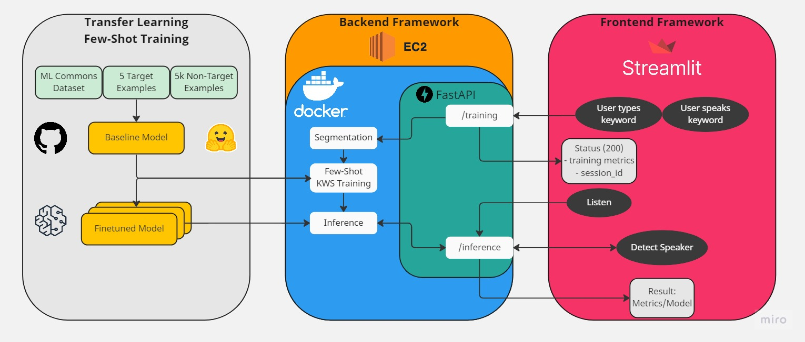

# Performance, interpretation, and learnings

Report and Observation:
the accuracy of a few-shot model can be quite sensitive to the particular samples chosen. A different set of five training samples will likely vary by a few percentage points from this model. The subset of unknown words and background noise also impact accuracy. Furthermore, some of the extracted test samples may be truncated (due to incorrect word boundary estimates) or occasionally anomalous due to issues with the originating crowdsourced data so a more accurate estimate of the test performance can only be made after manually listening to all test samples and discarding any malformed samples.
