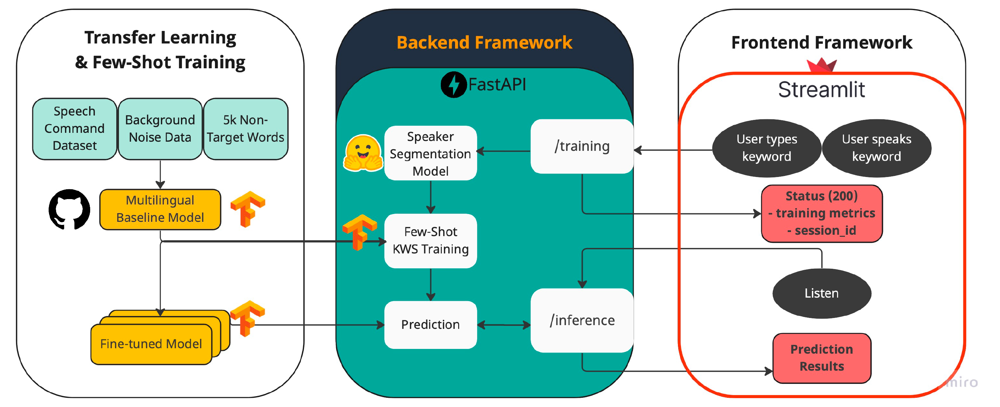
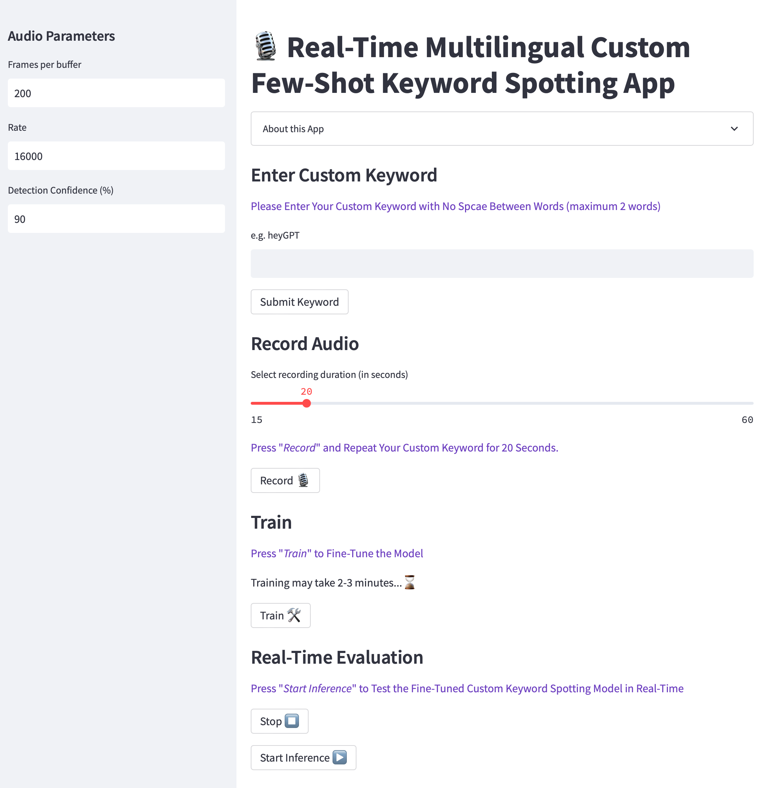

# Real-time Multilingual Custom Keyword Spotting 
- Built a lightweight few-shot keyword spotting (FS-KWS) for personalization of keyword spotting or wake-word detection running in real-time on an edge device.
- The customization is achieved by recording audio from the user for less than 30 seconds, followed by enhancement and segmentation of the speaker's audio clip to 1-second speech audio files via deep learning models [[1]](https://arxiv.org/pdf/2104.04045.pdf) and [[2]](https://arxiv.org/pdf/2106.04624.pdf). Segmented audio files are then used to fine-tune and customize an efficientnet-B0-based multilingual keyword spotting model through few-shot learning. The baseline model that we used in this study is based on [Harvard-edge](https://github.com/harvard-edge/multilingual_kws)[[3]](https://www.isca-speech.org/archive/pdfs/interspeech_2021/mazumder21_interspeech.pdf) work.
- Our model operates on short audio chunks (1 second) but at a much higher temporal resolution (every 25 ms).
- Average processing time for each 1-second audio chunk observed to be 35 ms.


## Solution Architecture


## Component Setup - step by step
**1.** Clone the Project 
```
git clone https://github.com/nasim-alamdari/RealTime-Custom-Keyword-Spotting.git
cd RealTime-Custom-Keyword-Spotting
```

**2.** Import and install relevant libraries to your Python project. 
```
conda create --name kws
conda activate kws
pip install -r requirement.txt
```
**3.** Regarding installing Pyaudio on M1 Mac or EC2 :
```
# for M1 Mac:
brew install portaudio
pip install PyAudio

# for EC2 Ubuntu:
sudo apt install libasound-dev portaudio19-dev libportaudio2 libportaudiocpp0 ffmpeg libav-tools
pip install PyAudio
```
**4. Enjoy real-time custom keyword spotting inside your streamlit app! 🎈**
```
cd Code
streamlit run streamlit_rltime_app.py
```

**5. To Deploy App on AWS EC2 Cloud ☁️🤖**

Follow Steps 1-3, then:
```
sudo apt-get install tmux
cd Code

tmux new -s sess_streamlit
streamlit run streamlit_ec2.py

tmux new -s sess_fastapi
uvicorn main_ec2:app --reload --workers 1 --host 0.0.0.0 --port 8000
```

## Keyword Spotting App on AWS EC2:
Using Streamlit and FastAPI Model Serving

Demo Link: [YouTube🎥](https://www.youtube.com/watch?v=quaSahxFPLQ)


## Real-Time Deployment via Streamlit:
The real-time version of Streamlit App should be run locally.

Demo Link: [YouTube🎥](https://www.youtube.com/watch?v=didUvy0FCV8)




### Contributors: 
[Nasim Alamdari](https://www.linkedin.com/in/nasim-alamdari/) and [Christos Magganas](https://www.linkedin.com/in/christos-magganas/)

Feel free to reach out to us in case you have any questions! <br>
Pls consider leaving a `star` ☆ with this repository to show your support.


